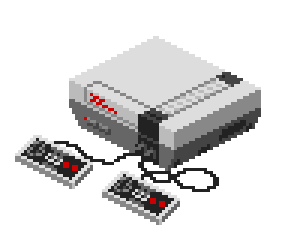
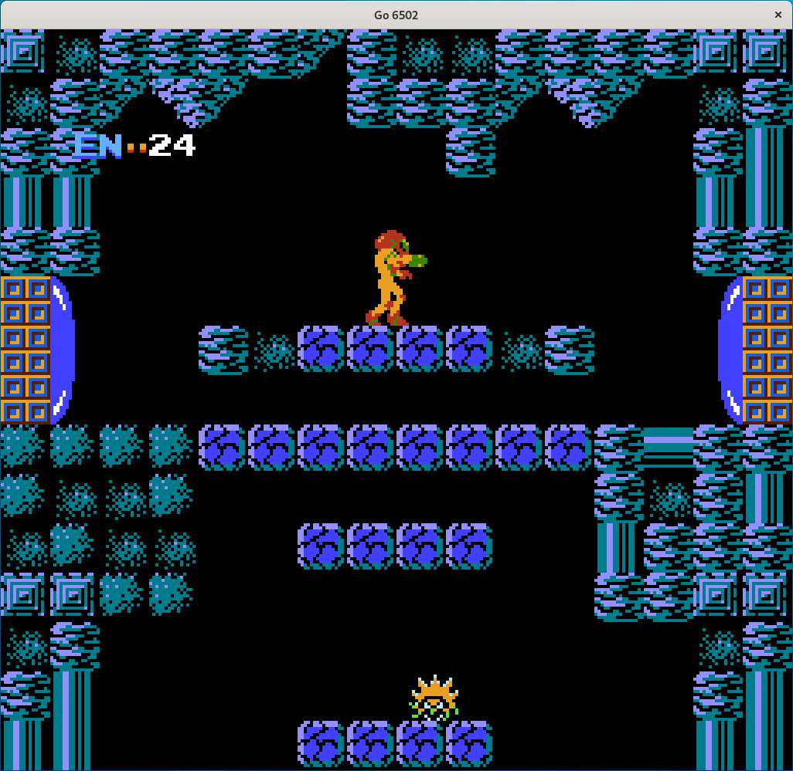
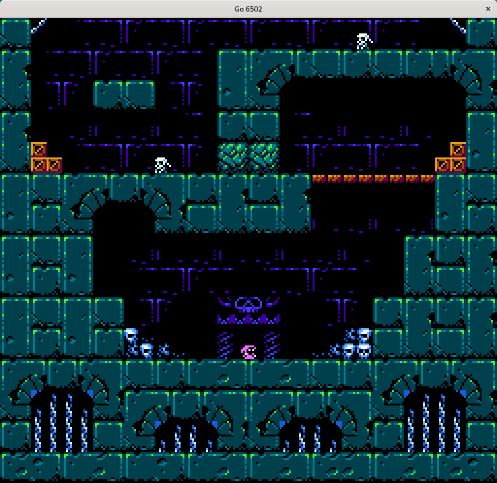
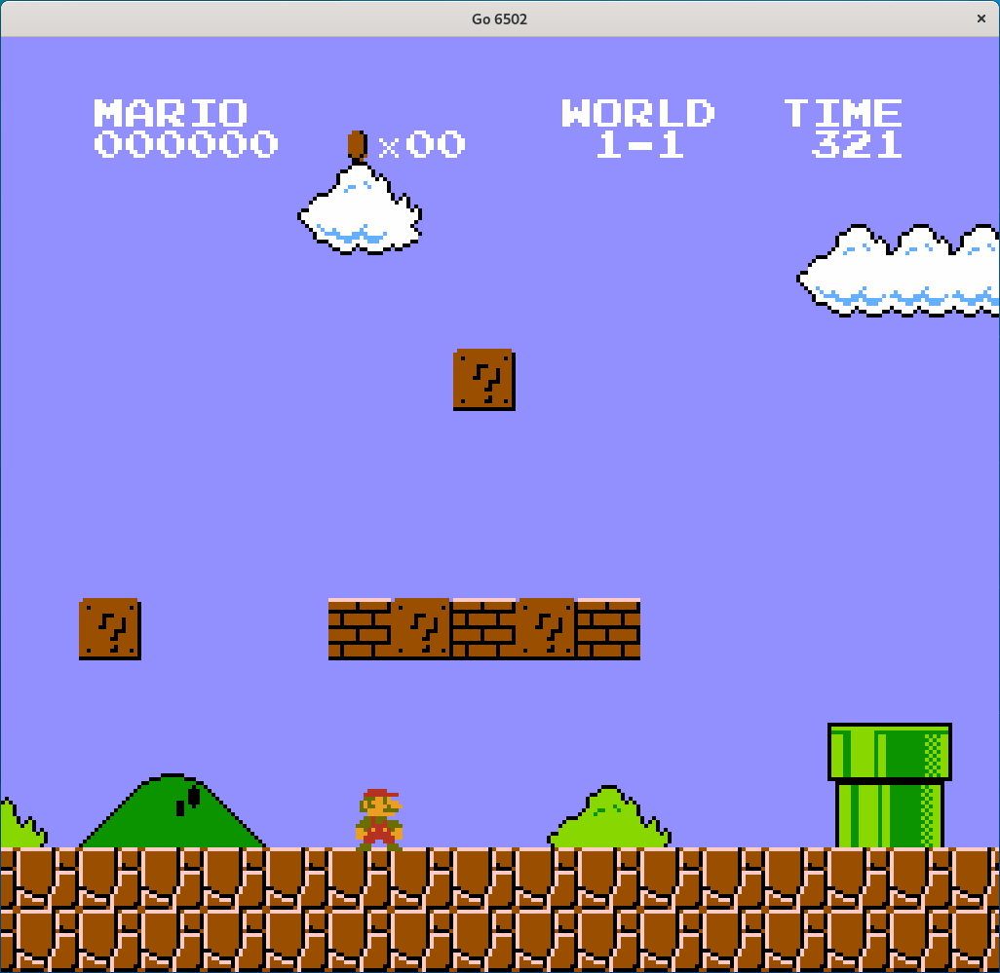

# go6502
Nintendo Entertainment System (NES) and Famicom emulator written in Go



## Dependencies
```
go get -u github.com/go-gl/gl
go get -u github.com/go-gl/glfw/v3.3/glfw
```

## Build and run
For build and run: 
```
go build cmd/go6502.go
./go6502 <game-path>
```

## TODO
 - [ ] Implement a sound system
 - [ ] Implement a configuration system for the gamepad
 - [ ] Improve performance
 - [ ] Implement debug tools

## Screenshots



